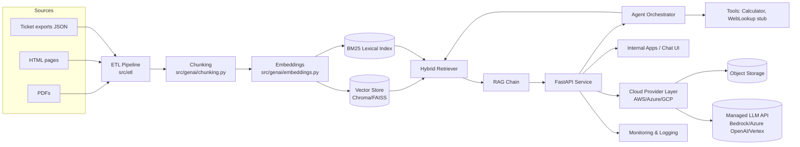
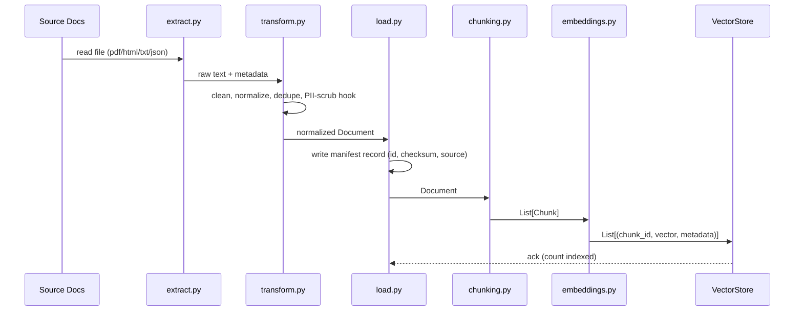
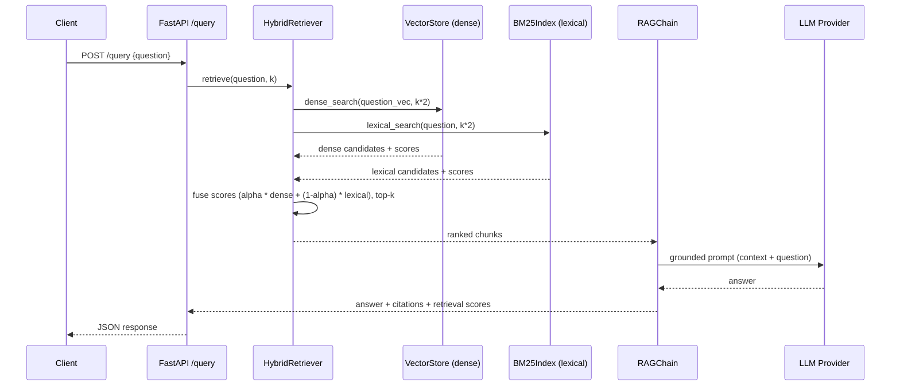
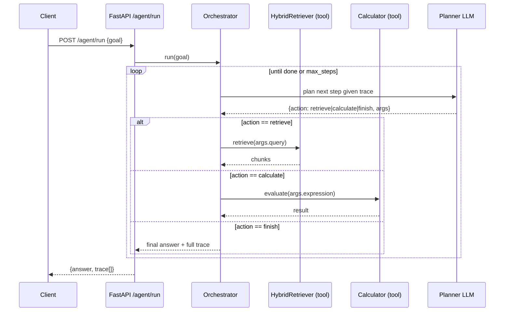
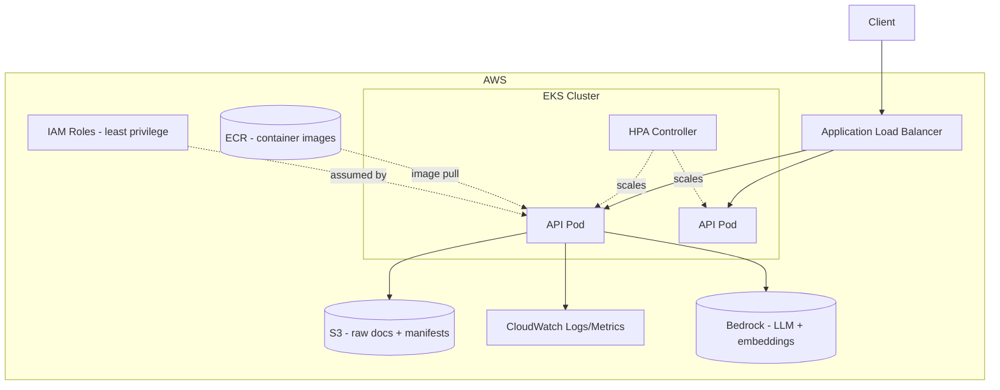

# Solution Architecture Design

**Author (persona):** Solution Architect
**Status:** Approved for build

## 1. Context Diagram

## 2. Component Responsibilities

| Component | Responsibility | Key files |
|---|---|---|
| ETL Pipeline | Extract raw text + metadata, normalize/clean, load into a staging store and trigger chunk/embed | `src/etl/extract.py`, `transform.py`, `load.py`, `pipeline.py` |
| Chunking | Split documents into retrieval-sized units with configurable strategy and overlap | `src/genai/chunking.py` |
| Embeddings | Turn chunks/queries into vectors via a pluggable provider (local or cloud) | `src/genai/embeddings.py` |
| Vector Store | Persist vectors + metadata, similarity search (cosine) | `src/genai/vector_store.py` |
| Hybrid Retriever | Fuse dense similarity + BM25 lexical scores (weighted, `alpha` tunable), optional re-rank | `src/genai/hybrid_retriever.py` |
| RAG Chain | Build grounded prompt from retrieved chunks, call LLM, return answer + citations | `src/genai/rag_chain.py` |
| Agent Orchestrator | Plan → Act → Observe loop; selects tools (retrieval, calculator); step-capped for cost control | `src/genai/agents/orchestrator.py`, `tools.py` |
| Fine-tuning module | LoRA-style domain adaptation demo on a small model/embedding set | `src/genai/finetuning/lora_finetune_demo.py` |
| API Layer | REST endpoints, request validation, auth stub, error handling | `src/api/*` |
| Cloud Provider Layer | Abstracts storage + managed-model access across AWS/Azure/GCP | `src/cloud/*` |
| Monitoring | Structured logging + Prometheus metrics | `src/monitoring/*` |

## 3. Data Flow — Ingestion (ETL)

## 4. Data Flow — Hybrid RAG Query

## 5. Agentic Workflow Orchestration

## 6. Technology Stack

| Layer | Choice | Notes |
|---|---|---|
| Language | Python 3.11 | Type-hinted, `pyproject.toml` packaging |
| API framework | FastAPI + Uvicorn | Async, OpenAPI auto-docs |
| Embeddings | `sentence-transformers` (local default) / OpenAI / Bedrock Titan / Azure OpenAI / Vertex AI | Pluggable via `EMBEDDING_PROVIDER` env var |
| Vector store | Chroma (local, default) / FAISS | Pluggable via `VECTOR_STORE` env var; interface supports adding pgvector/OpenSearch/Pinecone |
| Lexical index | `rank-bm25` | Powers hybrid fusion |
| LLM | Local deterministic stub (default, offline-safe) / OpenAI / Bedrock / Azure OpenAI / Vertex AI | Pluggable via `LLM_PROVIDER` |
| Fine-tuning | HuggingFace `transformers` + `peft` (LoRA) demo | Small model, CPU-runnable subset |
| Containerization | Docker, multi-stage build | `infra/docker/Dockerfile` |
| Orchestration | Kubernetes (Deployment, Service, HPA, ConfigMap) | `infra/k8s/` |
| IaC | Terraform (AWS: S3 bucket, ECR repo, IAM role, CloudWatch log group) | `infra/terraform/` |
| CI/CD | GitHub Actions | Lint → test → build → (push image) |
| Monitoring | `prometheus-client` metrics + structured JSON logs | `src/monitoring/` |

## 7. Cloud Deployment Topology (AWS primary)

Azure equivalent: AKS + Blob Storage + Azure Container Registry + Azure OpenAI + Azure Monitor.
GCP equivalent: GKE + GCS + Artifact Registry + Vertex AI + Cloud Monitoring.
The `src/cloud/` interface means only configuration and the Terraform/IaC module change — application code does not.

## 8. Security Architecture

- Secrets via environment variables / cloud secret manager (never committed — see `.env.example`).
- API key auth stub on all mutating endpoints (`X-API-Key` header), designed to be swapped for OAuth2/OIDC in production.
- Least-privilege IAM role for the workload (Terraform module scopes S3 + Bedrock invoke only).
- PII-scrub hook in `transform.py` (regex-based redaction pluggable point) before data reaches the vector store.
- Network: ALB → private subnet pods; vector store not internet-exposed.

## 9. Scalability & Cost Considerations

- Stateless API pods scale horizontally behind HPA on CPU + custom retrieval-latency metric.
- Vector store supports incremental upsert so re-indexing the whole corpus is not required per ingestion.
- Agent loop has a hard `max_steps` and per-run token budget to bound cost.
- Embedding calls are batched; local embedding model avoids per-call API cost during development.
